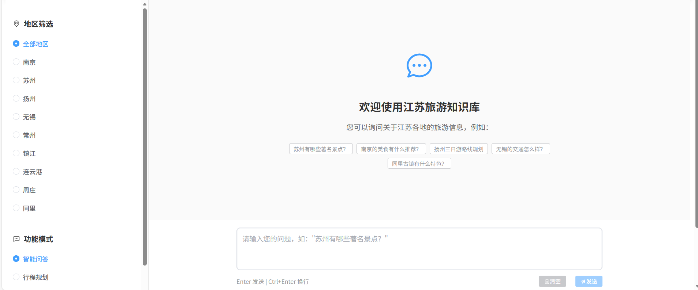
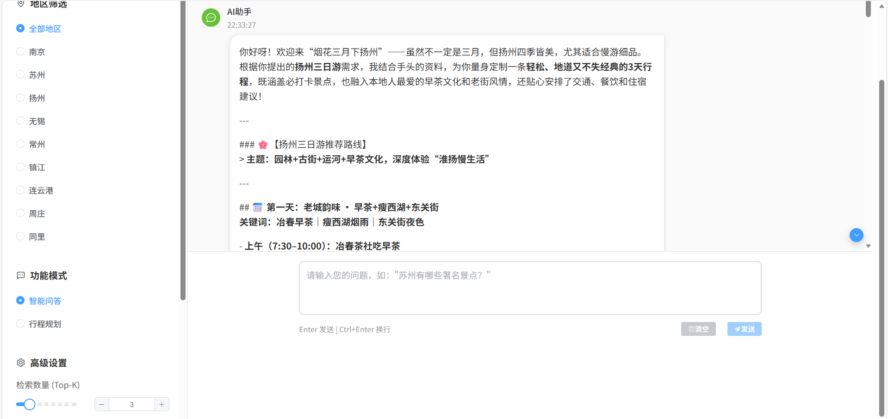
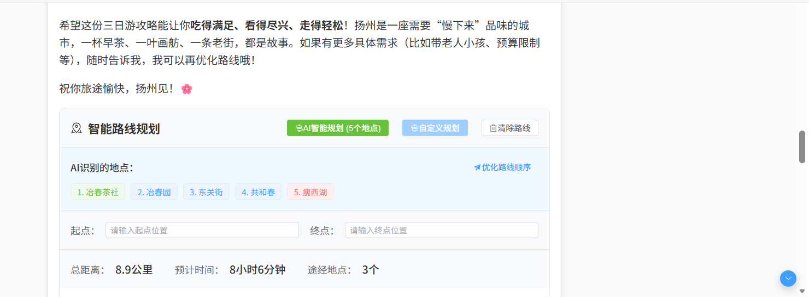
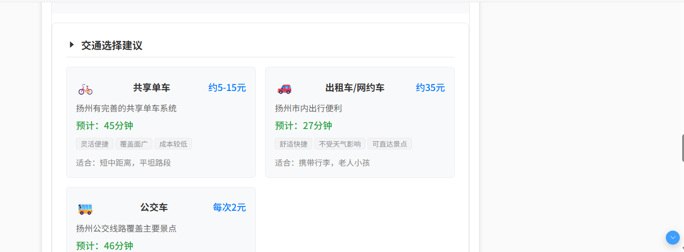
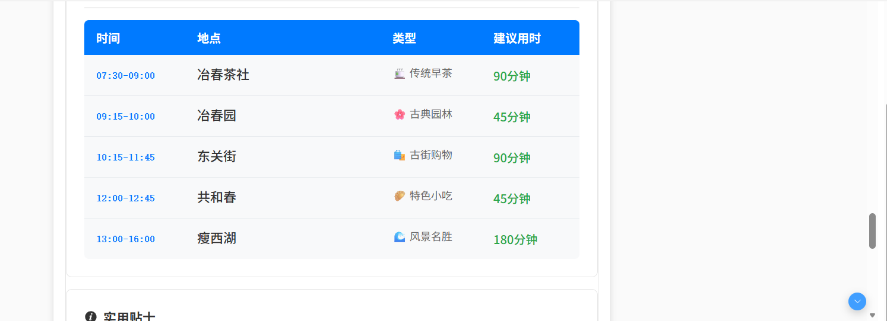
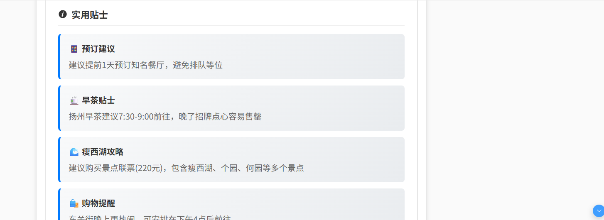

# 江苏旅游知识库项目

基于RAG(检索增强生成)技术的江苏地区旅游知识库问答系统，提供智能旅游咨询服务。

## 项目结构

```
├── backend/              # 后端Flask应用
│   ├── app/             # 应用主模块
│   ├── config/          # 配置文件
│   ├── utils/           # 工具模块
│   ├── scripts/         # 脚本文件
│   ├── app.py          # 应用入口
│   └── requirements.txt # Python依赖
├── frontend/            # 前端Vue3应用
│   ├── src/            # 源代码
│   ├── package.json    # Node.js依赖
│   └── vite.config.js  # 构建配置
├── data/               # 原始数据文件
├── vector_db/          # 向量数据库
└── docs/              # 文档
```

## 技术栈

### 后端
- Flask + Python 3.8+
- LangChain (RAG框架)
- ChromaDB (向量数据库)
- 阿里百炼API (嵌入模型 + 问答模型)

### 前端  
- Vue 3 + Composition API
- Element Plus (UI组件库)
- Axios (HTTP客户端)
- Vite (构建工具)

## 快速开始

### 1. 环境要求

- Python 3.8+
- Node.js 16+
- npm 或 yarn

### 2. 后端部署

```bash
# 进入后端目录
cd backend

# 安装Python依赖
pip install -r requirements.txt

# 配置环境变量（复制.env.example并重命名为.env）
# Windows PowerShell:
copy .env.example .env
# Linux/Mac:
# cp .env.example .env

# 编辑.env文件，填入您的真实API密钥
# 需要配置:
# - API_KEY: 阿里百炼API密钥（从 https://bailian.console.aliyun.com/ 获取）
# - AMAP_API_KEY: 高德地图API密钥（从 https://console.amap.com/ 获取）

# 构建知识库
python scripts/build_knowledge_base.py

# 启动Flask服务
python app.py
```

后端服务将在 `http://localhost:5000` 启动

### 3. 前端部署

```bash
# 进入前端目录  
cd frontend

# 安装依赖
npm install

# 启动开发服务器
npm run dev
```

前端应用将在 `http://localhost:3000` 启动

### 4. 生产部署

```bash
# 后端
cd backend
gunicorn -w 4 -b 0.0.0.0:5000 app:app

# 前端
cd frontend  
npm run build
# 将 dist 目录部署到 Web 服务器
```

## API接口

### 健康检查
```http
GET /api/health
```

### 普通问答
```http
POST /api/chat
Content-Type: application/json

{
  "question": "苏州有哪些著名景点？",
  "region": "all",
  "k": 3
}
```

### 流式问答
```http
GET /api/chat/stream?question=苏州有哪些著名景点？&region=all&k=3
Accept: text/event-stream
```

### 获取地区列表
```http
GET /api/regions
```

### 构建知识库
```http
POST /api/build-knowledge-base
Content-Type: application/json

{
  "reset": false
}
```

## 功能特性

**智能问答** - 基于RAG技术的自然语言问答  
**地区筛选** - 支持按江苏各地区筛选信息  
**流式输出** - 实时流式显示AI回答  
**来源展示** - 显示回答的相关文档来源  
**响应式界面** - 适配桌面和移动设备  
**错误处理** - 完善的错误提示和恢复机制  

## 系统截图

### 1. 系统主界面


### 2. 智能问答功能


### 3. 地区筛选


### 4. 流式输出展示




## 配置说明

### 后端环境变量配置

1. 复制 `backend/.env.example` 文件并重命名为 `backend/.env`
2. 填入您的真实API密钥

**环境变量说明：**

```env
# 阿里百炼API配置
API_BASE_URL=https://dashscope.aliyuncs.com/compatible-mode/v1
API_KEY=your_alibaba_bailian_api_key_here  # 在此填入您的阿里百炼API Key
EMBEDDING_MODEL=text-embedding-v1
CHAT_MODEL=qwen-max

# 高德地图API配置（可选，用于路径规划功能）
AMAP_API_KEY=your_amap_api_key_here  # 在此填入您的高德地图API Key

# 向量数据库配置
VECTOR_DB_PATH=../vector_db
CHUNK_SIZE=800
CHUNK_OVERLAP=200
TOP_K=3

# Flask配置
SECRET_KEY=your_secret_key_here  # 建议使用随机生成的密钥
DEBUG=True
```

**获取API密钥：**

- **阿里百炼API**: 访问 [阿里云百炼平台](https://bailian.console.aliyun.com/) 注册并获取API密钥
- **高德地图API**: 访问 [高德开放平台](https://console.amap.com/) 注册并创建应用获取Key

### 前端代理配置 (vite.config.js)

```js
server: {
  proxy: {
    '/api': {
      target: 'http://localhost:5000',
      changeOrigin: true
    }
  }
}
```

## 开发指南

### 添加新的旅游文档

1. 将PDF文档放入 `data/江苏地区/` 目录
2. 运行知识库构建脚本：
   ```bash
   cd backend
   python scripts/build_knowledge_base.py --reset
   ```

### 自定义AI提示词

编辑 `backend/utils/qa_system.py` 中的 `_build_context_prompt` 方法

### 前端组件扩展

- `Header.vue` - 页面头部
- `Sidebar.vue` - 侧边栏设置
- `ChatArea.vue` - 对话显示区域  
- `InputBox.vue` - 消息输入框

## 故障排除

### 常见问题

1. **向量数据库为空**  
   运行 `python backend/scripts/build_knowledge_base.py` 构建知识库

2. **API连接失败**  
   检查 `.env` 文件中的API配置是否正确

3. **跨域问题**  
   确保后端CORS配置正确，前端代理设置正确

4. **依赖安装失败**  
   尝试使用国内镜像源或升级pip/npm版本

## 许可证

MIT License

## 贡献

欢迎提交Issue和Pull Request来帮助改进项目！